# modui-client — developer guide

`modui-client` is a typed, class-based TypeScript client for the mod-ui backend. It talks to the server with
`fetch` (HTTP) and listens to the main WebSocket (`/websocket`), so callers can `await` operations until the
backend has *really* finished them (for example, until a pedalboard is fully loaded).

- **Source**: [`html/js/lib/modui-client/src/`](../html/js/lib/modui-client/src/)
- **Tests**: [`html/js/lib/modui-client/test/`](../html/js/lib/modui-client/test/)
- **Build output** (generated, not versioned): `html/js/lib/modui-client.js`
- **Wire contract**: [`docs/openapi.yml`](openapi.yml)
- **API coverage** (what is implemented, how to use it, what is recommended next): [`docs/modui-client/implementation-progress.md`](modui-client/implementation-progress.md)
- **Plan / roadmap**: [`docs/plans/2026-10-modui-client-pedalboard.md`](plans/2026-10-modui-client-pedalboard.md);
  live editing (plugins, connections): [`docs/plans/2026-10-modui-client-pedalboard-graph.md`](plans/2026-10-modui-client-pedalboard-graph.md)

Current scope: **pedalboards** (list, info, copy, remove, images, load, load default, reset, get / save / save-as of the running pedalboard), **live editing of the running pedalboard** (installed plugins; list / add / remove its plugins; list / connect / disconnect its connections; its own ports) plus raw WebSocket access.

---

## 1. Quick start

One walk-through, from an empty device to a saved pedalboard. Each step builds on the previous one, so you can read
it top to bottom or paste it into the browser console of a mod-ui page.

> The snippets use `await`; run them inside an `async` function or in a console that allows top-level `await`.
> Every operation resolves only after the backend *confirmed* it on the WebSocket (see section 5).

### 1.1 Start mod-ui

```sh
# Development: fake audio host, no JACK needed
MOD_DEV_HOST=1 MOD_DEV_ENVIRONMENT=0 python3 ./server.py      # http://localhost:8888/
```

On a real device mod-ui and mod-host are already running.

### 1.2 Create the client

In a mod-ui page, `index.html` loads the build and exposes `window.ModUiClient` (and `window.ModUi` with the other
classes, such as `ModUi.ImageStatus`).

```js
const client = new ModUiClient();                  // same origin as the page
```

Other setups:

```js
// Another origin, or Node.js >= 22 (global fetch and WebSocket)
const remote = new ModUiClient({ baseUrl: 'http://modduo.local' });

// Inside the classic UI, sharing its socket (window.ws from host.js) instead of opening a second one
const shared = new ModUiClient({ webSocket: window.ws });
```

The WebSocket is opened by the operations that need it (loading, live editing); `await client.connect()` opens it
earlier and `client.close()` closes it.

### 1.3 Browse the pedalboard library

`client.pedalboards` is the library of saved pedalboards: lightweight `PedalboardReference` handles.

```js
const pedalboards = await client.pedalboards.list();    // PedalboardReference[]
const rock = pedalboards.find((pb) => pb.title === 'Rock');
console.log(rock.title, rock.factory, rock.isDefault);

const info = await rock.info();                         // PedalboardInfo: plugins, connections, hardware ... (+ bundlepath)
```

Screenshot and thumbnail of any pedalboard of the library:

```js
const images = rock.images;
img.src = images.getThumbnailUrl();                     // sync, no request
if ((await images.status()) === ModUi.ImageStatus.Missing) {   // or Generating / Available
  await images.generate();                              // waits until the images exist
  img.src = images.getThumbnailUrl();                   // new URL, bypasses the browser cache
}
```

### 1.4 Load a pedalboard

`client.device` is what is *running*. Loading is `GET /reset` + `POST /pedalboard/load_bundle/` + wait for `loading_end`.

```js
const result = await client.device.load(info);          // or load(rock): a reference works too
console.log(result.name, result.snapshotId);

await client.device.loadDefault();                      // the empty "Untitled" pedalboard
await client.device.reset();                            // remove every plugin and connection
```

From here on, all changes are made on the running pedalboard, which the examples call `currentPedalboard`.
They are queued behind `load()`, `reset()` and saves.

```js
const currentPedalboard = client.device.currentPedalboard;
```

### 1.5 Add plugins

The installed plugins (the catalogue) are `Plugin` objects; the ones in the running pedalboard are `PluginInstance`s.

```js
// Catalogue
const plugins = await client.device.plugins.list();     // Plugin[] (summaries)
const gainPlugin = plugins.find((plugin) => plugin.label === 'Gain');
console.log(gainPlugin.uri, gainPlugin.name, gainPlugin.brand, gainPlugin.category);
const details = await gainPlugin.info();                // PluginInfo: ports, parameters, presets (cached)

// Running pedalboard
const instances = await currentPedalboard.plugins.list();                          // PluginInstance[]
const gain = await currentPedalboard.plugins.add(gainPlugin, { x: 200, y: 100 });  // position is optional (default 0, 0)
console.log(gain.instance);                                                        // "/graph/Gain" ("/graph/Gain_1" if taken)
console.log(gain.x, gain.y, gain.bypassed, gain.uri);

await currentPedalboard.plugins.add('http://moddevices.com/plugins/mod-devel/Gain');  // a plain URI works too
```

### 1.6 Ports

Ports are grouped by type and direction. Control ports are not listed here: they are parameters (see 1.8).

```js
// Ports of a plugin instance
gain.ports.audio.input;     // Port[]  e.g. "/graph/Gain/in"
gain.ports.audio.output;    // Port[]  e.g. "/graph/Gain/out"
gain.ports.midi.input;      // Port[]   (also .midi.output, .cv.input, .cv.output)
const gainIn = gain.ports.audio.input[0];                  // or by symbol: gain.port('in') (Port | undefined)
const gainOut = gain.ports.audio.output[0];

// Ports of the pedalboard itself: same layout, but they come from the WebSocket, so input() / output() are
// functions that return a promise (in this client an attribute is never asynchronous)
const [capture] = await currentPedalboard.ports.audio.output();   // "/graph/capture_1": a source; owner === null
const [playback] = await currentPedalboard.ports.audio.input();   // "/graph/playback_1": a sink
const [midiSink] = await currentPedalboard.ports.midi.input();    // also .midi.output(), .cv.input(), .cv.output()
const everyPort = await currentPedalboard.ports.list();           // Port[]: audio, midi, cv; sources first
```

### 1.7 Connect

A `PedalboardConnection` always goes from an output to an input of the same type.

```js
const first = await currentPedalboard.connections.connect(capture, gainIn);   // Port objects...
const second = await currentPedalboard.connections.connect(gainOut.id, playback.id);  // ...or port ids
await currentPedalboard.connections.connect(capture, playback);               // pedalboard port to pedalboard port is fine
await currentPedalboard.connections.connect(capture, gainIn);                 // already connected: returns it, no request

const all = await currentPedalboard.connections.list();                       // PedalboardConnection[]
all.forEach((c) => console.log(c.from.id, '->', c.to.id));
```

Invalid pairs are rejected before any request (`ModUiError`):

```js
await currentPedalboard.connections.connect(gainIn, capture).catch((e) => console.log(e.message));  // input -> output
await currentPedalboard.connections.connect(capture, midiSink).catch(() => {});                     // audio -> midi
```

### 1.8 Bypass, parameters and position

```js
// Bypass: "active" = processing audio
await gain.isActive();                                 // true / false, read from the live state
await gain.setActive(false);                           // bypass
const nowActive = await gain.toggle();                 // resolves with the new state

// Parameters ("Param"): the control inputs, knobs and switches of the plugin
const params = gain.params.list();                     // Param[], synchronous (the description is already known)
const gainParam = gain.params.get('gain');             // Param | undefined, by symbol
console.log(gainParam.symbol, gainParam.name, gainParam.default, gainParam.minimum, gainParam.maximum);
console.log(gainParam.value);                          // current value: a live attribute, no request
await gainParam.setValue(3.5);                         // throws ModUiError outside minimum..maximum, for NaN, or for a port the host drives

// Position in the canvas
console.log(gain.x, gain.y);                           // live attributes
await gain.move({ x: 320, y: 140 });

// Patch parameters ("PatchParam"): typed values that are not control ports (strings, file paths, URIs, booleans, integers)
// `plugin`: a PluginInstance whose plugin declares patch parameters
const label = plugin.patchParams.get('http://example.org/plugin#label');   // PatchParam | undefined, by URI
plugin.patchParams.list();                             // PatchParam[], synchronous; vectors and other atom types are left out
console.log(label.type, label.writable, label.readable, label.default);    // type: 'bool' | 'int' | 'long' | 'float' | 'double' | 'string' | 'path' | 'uri'
console.log(label.value);                              // live attribute, undefined until a value is known
await label.setValue('Verse');                         // validated by type; throws ModUiError and sends nothing when it does not fit
console.log(await label.refresh());                    // asks the plugin (patch_get) and waits for its answer; ModUiTimeoutError if silent
```

### 1.9 Save the pedalboard

```js
const current = await currentPedalboard.get();         // PedalboardReference | null (null = untitled)
await currentPedalboard.save();                        // overwrite it, keeping its title
await currentPedalboard.save('New name');              // overwrite and rename
const solo = await currentPedalboard.saveAs('Solo');   // new bundle ("Solo (2)" if taken)
```

`save()` and `saveAs()` resolve after the screenshot and thumbnail were regenerated (see 5.2).

### 1.10 Manage the library

```js
const mine = (await client.pedalboards.list()).filter((pb) => !pb.factory && !pb.isDefault);
const duplicate = await mine[0].copy();                // new pedalboard, "<title> (2)", running one untouched
await mine[0].remove();                                // throws ModUiError for factory / default pedalboards
```

### 1.11 Remove connections and plugins

```js
await currentPedalboard.connections.disconnect(first);    // throws ModUiError if it is not connected
await gain.remove();                                      // same as currentPedalboard.plugins.remove(gain)
await currentPedalboard.plugins.remove('/graph/Gain_1');  // by path; the leading slash is optional
```

Removing a plugin also removes its connections.

### 1.12 Listen to raw WebSocket messages

Everything above is built on `client.events`, which you can also use directly.

```js
const off = client.events.on('stats', (args) => {
  const [cpuLoad, xruns] = args.split(' ');
  console.log(`CPU ${cpuLoad}% / ${xruns} xruns`);
});
await client.connect();
off();
```

### 1.13 Notes

- `PatchParam.setValue()` is also fire-and-forget (`patch_set`, not confirmed to the sender); `refresh()` is the only call
  with an answer (`patch_get` → `patch_set` to every socket). It waits outside the device queue, so a silent plugin does not
  block loads or saves. Strings must be non-empty and free of control characters; numbers must fit the type and the range.
- `setValue()`, `setActive()`, `toggle()` and `move()` are WebSocket messages (`param_set`, `plugin_pos`) that the backend
  never confirms to the socket that sent them (only to the others), so they resolve **once the message was sent**, and the
  attributes (`value`, `x`, `y`) and `isActive()` already show the new state. They are queued behind loads and saves.
- The client checks before sending because the backend raises (and closes the socket) when the plugin does not exist.
- `list()` is asynchronous because no endpoint lists the running plugins or connections: the client builds them
  from the WebSocket (the state replay plus live frames), so changes made by the classic UI or by other clients show up too.
- `x`, `y`, `Param.value` and `isActive()` read the live state, so a `PluginInstance` you already hold follows changes made
  by the classic UI or other clients. List again to learn about plugins that were added or removed.
- The instance name is always generated (like the classic UI does).
- Errors are `ModUiError` (invalid pair, unknown port or plugin, refused by the backend), `ModUiTimeoutError`
  (the confirming frame never came; `graphTimeoutMs`, default 10 s) and `ModUiHttpError` (non-2xx).

Compared with [PedalPi PluginsManager](https://github.com/PedalPi/PluginsManager#example), on which this walk-through
is modelled: there are no banks (the library is a flat list of pedalboards), no `ModHost.connect()` (mod-ui already owns
the connection to mod-host), and the plugin builder is `client.device.plugins` (the catalogue) plus
`currentPedalboard.plugins.add()`. Operations are asynchronous because the backend confirms them over the network.
The per-operation comparison is in [`docs/modui-client/implementation-progress.md`](modui-client/implementation-progress.md).

---

## 2. Where it sits

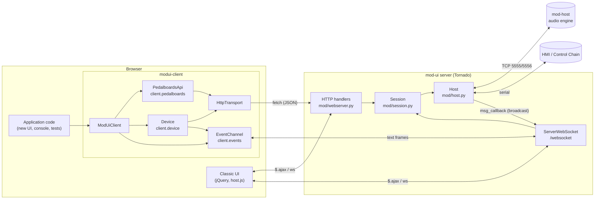

Every change made through HTTP is broadcast by the backend to **all** WebSocket clients, which is how the
classic UI, other tabs and this client stay in sync.

---

## 3. Source layout

```
html/js/lib/modui-client/
├── package.json         # devDependencies only: typescript, esbuild, vitest (exact versions)
├── tsconfig.json        # strict, noEmit, ES2018 + DOM
├── src/
│   ├── index.ts         # public exports + window.ModUiClient / window.ModUi (build entry)
│   ├── client.ts        # ModUiClient, ModUiClientOptions
│   ├── pedalboards.ts   # PedalboardsApi, PedalboardReference
│   ├── pedalboard-images.ts   # PedalboardImages (reference.images), ImageStatus
│   ├── device.ts        # Device
│   ├── current-pedalboard.ts  # CurrentPedalboard (client.device.currentPedalboard)
│   ├── plugins.ts       # PluginsApi (client.device.plugins), Plugin
│   ├── pedalboard-plugins.ts      # PedalboardPlugins (currentPedalboard.plugins)
│   ├── pedalboard-connections.ts  # PedalboardConnections, PedalboardPorts, PedalboardPortGroup (currentPedalboard.connections / .ports)
│   ├── pedalboard-graph.ts        # PluginInstance, Port, PedalboardConnection + the internal engine
│   ├── patch-params.ts            # PatchParam, PluginPatchParams (instance.patchParams)
│   ├── graph-state.ts   # internal: WebSocket-fed model of the running graph
│   ├── events.ts        # EventChannel, MessageHandler, Waiting
│   ├── http.ts          # HttpTransport (internal)
│   ├── errors.ts        # ModUiError, ModUiHttpError, ModUiTimeoutError
│   ├── types.ts         # wire types (mirror docs/openapi.yml schemas) + LoadOptions/LoadResult
│   └── runtime.ts       # FetchLike, WebSocketLike, WebSocketFactory
└── test/
    ├── helpers.ts       # FakeWebSocket, fakeFetch, fixtures, makeClient, connected, flush
    ├── client.test.ts
    ├── pedalboards.test.ts
    ├── pedalboard-images.test.ts
    ├── device.test.ts
    ├── current-pedalboard.test.ts
    ├── plugins.test.ts
    ├── pedalboard-graph.test.ts
    └── events.test.ts
```

Module dependencies (arrows point to what a module imports):

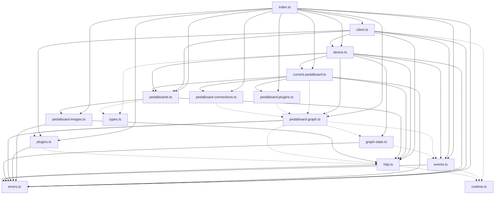

Dotted arrows are type-only imports. There are no cycles; `types.ts` and `runtime.ts` import nothing.

---

## 4. Class diagram

```mermaid
classDiagram
  direction LR

  class ModUiClient {
    +baseUrl: string
    +device: Device
    +pedalboards: PedalboardsApi
    +events: EventChannel
    +constructor(options?: ModUiClientOptions)
    +connect() Promise~void~
    +close() void
  }

  class PedalboardsApi {
    -http: HttpTransport
    +list() Promise~PedalboardReference[]~
  }

  class PedalboardReference {
    +bundlepath: string
    +title: string
    +uri: string
    +broken: boolean
    +factory: boolean
    +hasTrialPlugins: boolean
    +version: number
    +summary: PedalboardSummary
    +images: PedalboardImages
    +isDefault: boolean
    +info() Promise~PedalboardInfo~
    +copy() Promise~PedalboardReference~
    +remove() Promise~void~
  }

  class Device {
    -queue: Promise
    -defaultTimeoutMs: number
    +currentPedalboard: CurrentPedalboard
    +load(target: PedalboardTarget, options?: LoadOptions) Promise~LoadResult~
    +loadDefault(options?: LoadOptions) Promise~LoadResult~
    +reset() Promise~void~
  }

  class PedalboardImages {
    -ctime: string
    +getThumbnailUrl() string
    +getScreenshotUrl() string
    +status() Promise~ImageStatus~
    -waitPending() Promise~ImageStatus~
    +generate() Promise~void~
  }

  class ImageStatus {
    <<enumeration>>
    Missing
    Generating
    Available
  }

  class CurrentPedalboard {
    -enqueue: Enqueue
    +plugins: PedalboardPlugins
    +connections: PedalboardConnections
    +ports: PedalboardPorts
    +get() Promise~PedalboardReference | null~
    +save(newTitle?: string) Promise~PedalboardReference~
    +saveAs(suggestedTitle: string) Promise~PedalboardReference~
  }

  class PluginsApi {
    +list() Promise~Plugin[]~
  }
  class Plugin {
    +uri: string
    +name: string
    +label: string
    +info() Promise~PluginInfo~
  }
  class PedalboardPlugins {
    +list() Promise~PluginInstance[]~
    +add(plugin: PluginTarget, position?: Position) Promise~PluginInstance~
    +remove(instance) Promise~void~
  }
  class PedalboardConnections {
    +list() Promise~PedalboardConnection[]~
    +connect(from: Port | string, to: Port | string) Promise~PedalboardConnection~
    +disconnect(connection: PedalboardConnection) Promise~void~
  }
  class PedalboardPorts {
    +audio: PedalboardPortGroup
    +midi: PedalboardPortGroup
    +cv: PedalboardPortGroup
    +list() Promise~Port[]~
  }
  class PedalboardPortGroup {
    +input() Promise~Port[]~
    +output() Promise~Port[]~
  }
  class PluginInstance {
    +instance: string
    +uri: string
    +x: number
    +y: number
    +info: PluginInfo | null
    +ports: PortGroups
    +params: PluginParams
    +patchParams: PluginPatchParams
    +port(symbol) Port | undefined
    +isActive() Promise~boolean~
    +setActive(active: boolean) Promise~void~
    +toggle() Promise~boolean~
    +move(position: Position) Promise~void~
    +remove() Promise~void~
  }
  class PluginParams {
    +list() Param[]
    +get(symbol) Param | undefined
  }
  class PluginPatchParams {
    +list() PatchParam[]
    +get(uri) PatchParam | undefined
  }
  class PatchParam {
    +uri: string
    +label: string
    +type: PatchParamType
    +readable: boolean
    +writable: boolean
    +default: PatchValue
    +minimum: number
    +maximum: number
    +fileTypes: string[]
    +supportedExtensions: string[]
    +value: PatchValue
    +refresh(options) Promise~PatchValue~
    +setValue(value: PatchValue) Promise~void~
  }
  class Param {
    +symbol: string
    +name: string
    +default: number
    +minimum: number
    +maximum: number
    +designation: string
    +properties: string[]
    +value: number
    +setValue(value: number) Promise~void~
  }
  class Port {
    +id: string
    +symbol: string
    +name: string
    +type: audio | midi | cv
    +direction: input | output
    +owner: PluginInstance | null
  }
  class PedalboardConnection {
    +from: Port
    +to: Port
    +id: string
  }
  class PedalboardGraph {
    <<internal>>
  }
  class GraphState {
    <<internal>>
    +ready() Promise~GraphModel~
  }

  class EventChannel {
    -socket: WebSocketLike
    -owned: boolean
    -handlers: Map
    -waiters: Set
    +connected: boolean
    +connect() Promise~void~
    +on(command, handler: MessageHandler) unsubscribe
    +waitFor(command, timeoutMs, predicate?) Waiting
    +send(text: string) void
    +close() void
  }

  class HttpTransport {
    <<internal>>
    -baseUrl: string
    -fetchImpl: FetchLike
    +getJson~T~(path, query?) Promise~T~
    +postForm~T~(path, form) Promise~T~
  }

  class ModUiError {
    +name: string
    +message: string
  }
  class ModUiHttpError {
    +status: number
    +url: string
    +body: string
  }
  class ModUiTimeoutError

  class WebSocketLike {
    <<interface>>
    +readyState: number
    +send(data) void
    +close() void
    +addEventListener(type, listener) void
    +removeEventListener(type, listener) void
  }

  class ModUiClientOptions {
    <<interface>>
    +baseUrl?: string
    +fetch?: FetchLike
    +WebSocket?: WebSocketFactory
    +webSocket?: WebSocketLike
    +loadTimeoutMs?: number
    +connectTimeoutMs?: number
    +graphTimeoutMs?: number
  }

  ModUiClient *-- PedalboardsApi
  ModUiClient *-- Device
  ModUiClient *-- EventChannel
  Device *-- CurrentPedalboard
  Device *-- PluginsApi : plugins
  PluginsApi ..> Plugin : creates
  CurrentPedalboard *-- PedalboardPlugins : plugins
  CurrentPedalboard *-- PedalboardConnections : connections
  CurrentPedalboard *-- PedalboardPorts : ports
  PedalboardPorts *-- PedalboardPortGroup : audio, midi, cv
  PedalboardPlugins --> PedalboardGraph
  PedalboardConnections --> PedalboardGraph
  PedalboardPorts --> PedalboardGraph
  PedalboardGraph --> GraphState : reads
  PedalboardGraph --> EventChannel : waits for add, remove, connect, disconnect
  PedalboardGraph --> PluginsApi : plugin descriptions
  PedalboardGraph ..> PluginInstance : creates
  PedalboardGraph ..> PedalboardConnection : creates
  PluginInstance *-- "*" Port : ports.audio.input, .audio.output, .midi.*, .cv.*
  PluginInstance *-- PluginParams : params
  PluginParams *-- "*" Param : list(), get(symbol)
  Param --> PluginInstance : owner
  PluginInstance *-- PluginPatchParams : patchParams
  PluginPatchParams *-- "*" PatchParam : list(), get(uri)
  PatchParam --> PluginInstance : owner
  PedalboardConnection --> Port : from, to
  GraphState --> EventChannel : on(...) before connect()
  ModUiClient ..> ModUiClientOptions : configured by
  ModUiClient ..> HttpTransport : creates
  PedalboardsApi --> HttpTransport
  PedalboardsApi ..> PedalboardReference : creates
  PedalboardReference --> HttpTransport
  PedalboardReference *-- PedalboardImages : images
  PedalboardImages --> HttpTransport
  PedalboardImages ..> ImageStatus : returns
  CurrentPedalboard ..> PedalboardImages : waits for the thumbnail after a save
  Device --> HttpTransport
  Device --> EventChannel
  Device --> PedalboardsApi : loadDefault()
  CurrentPedalboard --> HttpTransport
  CurrentPedalboard --> PedalboardsApi : finds the saved bundle
  CurrentPedalboard ..> PedalboardReference : returns
  CurrentPedalboard ..> Device : shares its queue
  EventChannel --> WebSocketLike
  Error <|-- ModUiError
  ModUiError <|-- ModUiHttpError
  ModUiError <|-- ModUiTimeoutError
  HttpTransport ..> ModUiHttpError : throws
  EventChannel ..> ModUiTimeoutError : throws
```

### Data model

`PedalboardReference` is a lightweight handle built from a list entry; `PedalboardInfo` is the full bundle content.
Both carry `bundlepath`, so both can be passed to `Device.load()` (type `PedalboardTarget`).

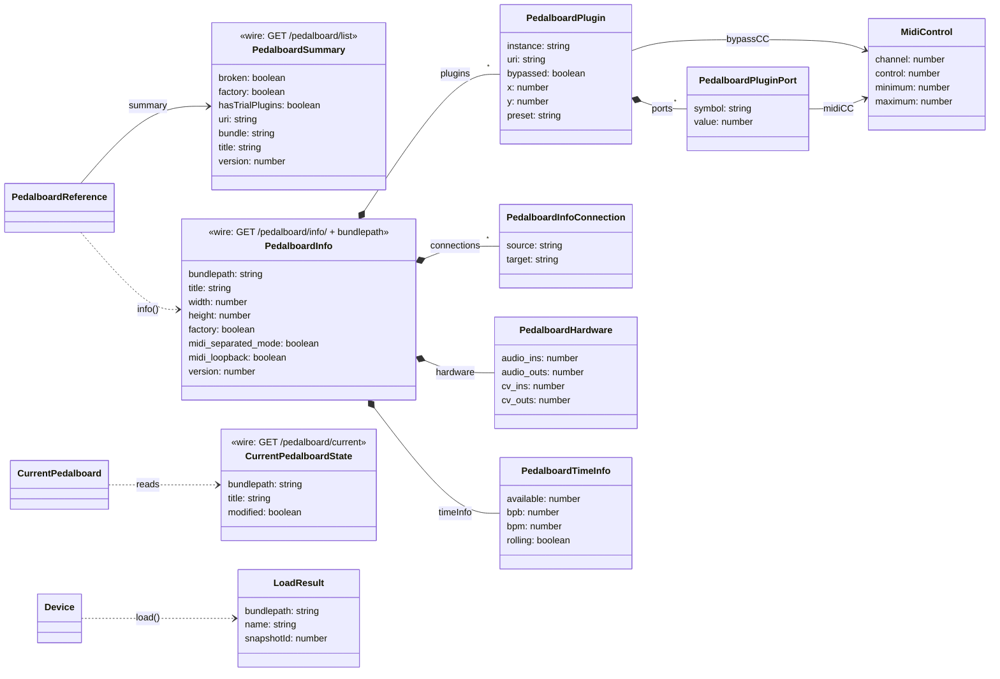

---

## 5. Key flows

### 5.1 Loading a pedalboard (`device.load`)

The backend pushes `loading_start … loading_end` on the WebSocket **during** the `load_bundle` request, i.e.
usually *before* the HTTP response. The client therefore registers the wait first, then sends the request.
`load_bundle` does not clear the running graph, so a reset always comes first (same sequence as the classic UI).

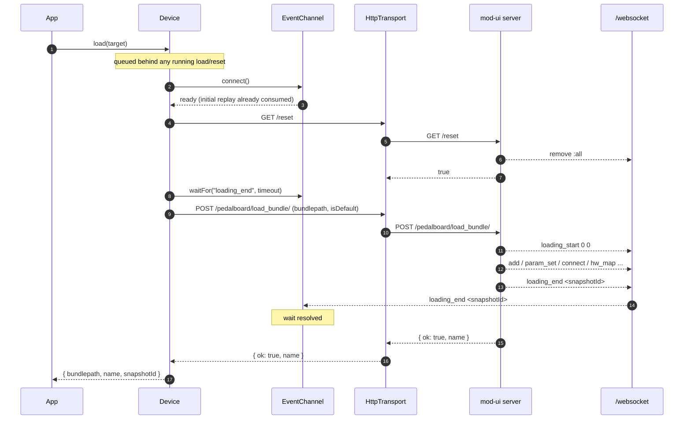

Failure paths:

| Situation | Result |
|-----------|--------|
| `/reset` answers `false` | `ModUiError("…refused to reset…")`; `load_bundle` is not called |
| `load_bundle` answers `{ ok: false }` (bundle missing) | wait cancelled, `ModUiError("…could not load…")` |
| non-2xx HTTP status | wait cancelled, `ModUiHttpError` (status, url, body) |
| no `loading_end` within `timeoutMs` (default 60 s) | `ModUiTimeoutError` |
| socket closes or the server sends `stop` | `ModUiError("WebSocket closed" / "backend stopped")` |

`device.loadDefault()` is the same flow, after picking the list entry whose bundle ends in
`/default.pedalboard`, and with `isDefault=1` (the backend then clears the current title and path).

### 5.2 Saving the running pedalboard (`currentPedalboard.save` / `saveAs`)

`POST /pedalboard/save` always needs a `title` and an `asNew` flag (see `savePedalboard` in `docs/openapi.yml` for
the exact rules). The client hides both: `save()` means `asNew=0` and reads the current title when you do not pass
one; `saveAs()` means `asNew=1`. Both return the saved pedalboard as a `PedalboardReference` found in the list.

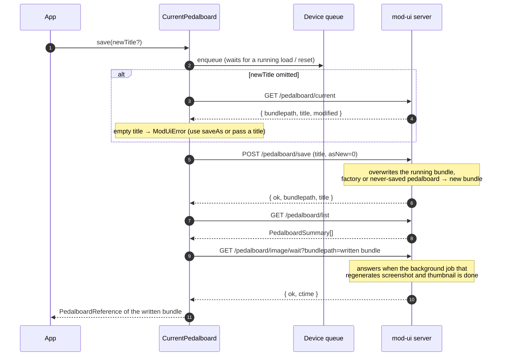

What the backend does with `asNew`:

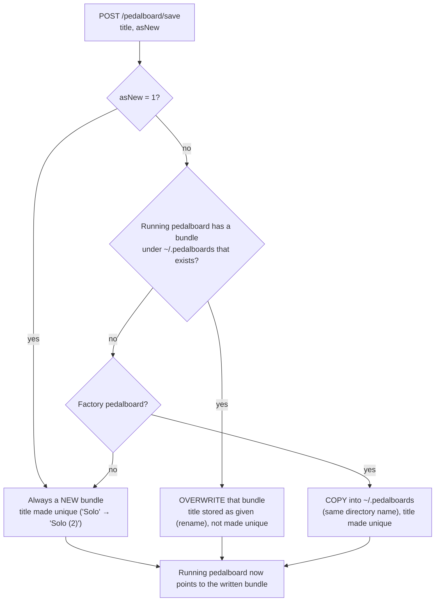

The promise of `save()` / `saveAs()` resolves only after `GET /pedalboard/image/wait` answered, i.e. when the
screenshot and the thumbnail that the save regenerates in the background are ready. The pedalboard is already
saved at that point, so if the wait fails (or nothing could be rendered) the save is **not** reported as failed.

`currentPedalboard.get()` returns `null` for an untitled pedalboard (after `reset()` or `loadDefault()`), because it
has no bundle. It needs the backend endpoint `GET /pedalboard/current`.

### 5.3 Copying a pedalboard (`reference.copy`)

`GET /pedalboard/factorycopy/` is the only copy resource. Despite its name it copies **any** bundle (not only factory
ones) and never touches the running pedalboard. The server chooses the new title (the old one made unique:
`"Rock"` → `"Rock (2)"`, unchanged if free) and renames the copy by running `sed` through a shell with the title
pasted in, so the title must be the one **stored in the bundle** and must not contain characters that break the
shell or `sed`. The client therefore reads the stored title first and refuses unsafe ones before copying.
`copy()` takes no title: the title of the copy cannot be chosen without changing the backend (see the plan).

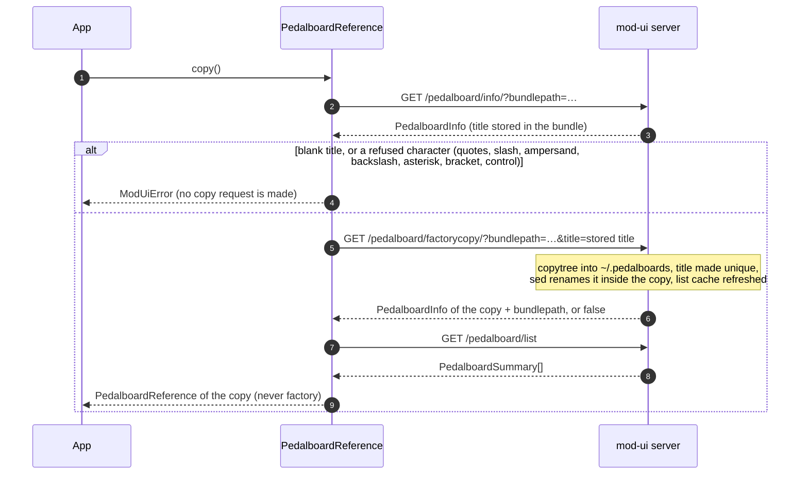

Pedalboards whose title has a refused character can only be duplicated with `device.load(ref)` followed by
`device.currentPedalboard.saveAs(title)`, which **replaces** the running pedalboard.

### 5.4 Pedalboard images (`reference.images`)

The files `screenshot.png` / `thumbnail.png` live inside each bundle. They are rendered by a background process
from the **saved bundle** (so never from the running state), after a save that changed the graph or on demand.
The endpoints work for **any** bundle, not only the running pedalboard. Image URLs are cached for a year by the
server, so the client adds `v=<pedalboard version>` and, once known, `tstamp=<creation time>`.

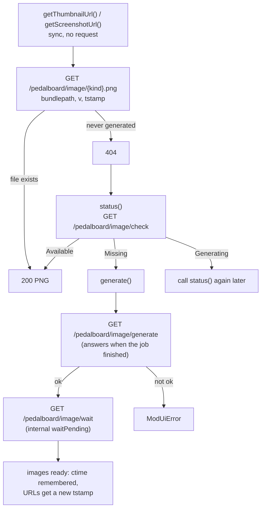

`generate()` replaces the files, so it fails for factory pedalboards on a device (read-only filesystem) with a `ModUiError`.

`waitPending()` is private to `PedalboardImages`. `generate()` always ends with it, and so do `currentPedalboard.save()`
and `saveAs()` (see 5.2), through an internal helper that the package does not export.

### 5.5 Connecting and flow control (`events.connect`)

A new socket first receives a replay of the whole current state, which ends with `loading_end`. `connect()`
resolves only after it, so that replay is never mistaken for the end of a load requested later.

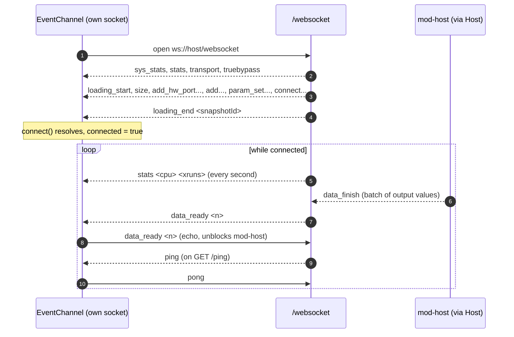

With a **shared** socket (`options.webSocket`), `connect()` resolves as soon as the socket is open and the
client never answers `ping` / `data_ready`, because the socket's owner (the classic UI's `host.js`) already does.

### 5.6 Live editing: the graph model, `plugins.add`, `connections.connect`

No HTTP endpoint lists the plugins or the connections of the running pedalboard, so `GraphState` registers `on(...)`
handlers **before** the socket is opened and builds a model from the frames: the state replay of a new socket
(`add_hw_port`, `add`, `connect`, ...) and the live ones after it. `loading_start` and `remove :all` clear the
plugins and connections (the pedalboard's own ports stay: a load does not send them again).
With a shared socket the replay has already passed, so `ready()` reads one snapshot through a short-lived second
socket (frames that arrive meanwhile are applied on top of it).

Port ids come from two places: plugin ports from `PluginInfo.ports` (`audio`, `midi`, `cv`; control ports are not
connectable), fetched with one `POST /effect/bulk/` for the plugins not seen yet; the pedalboard's own ports from
`add_hw_port`, where the backend's "input of the device" (`direction 0`) is a *source* for the graph.

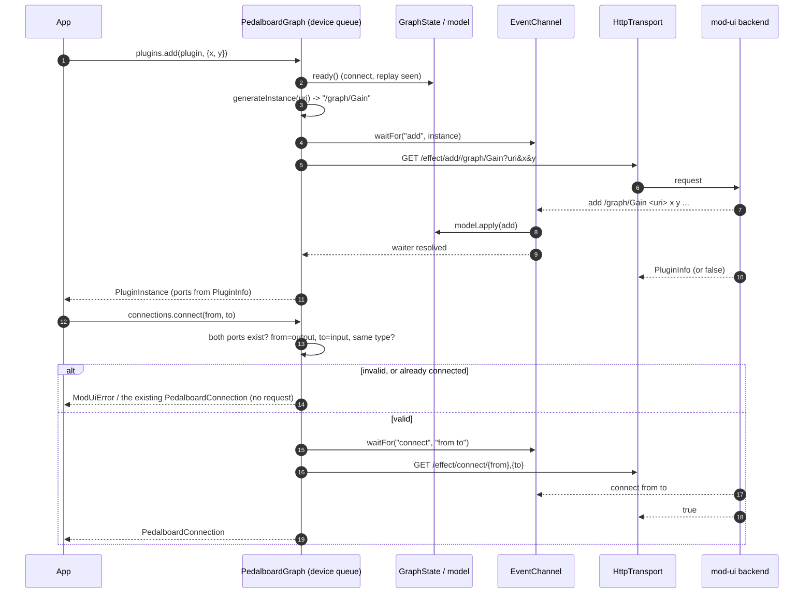

### 5.7 EventChannel lifecycle

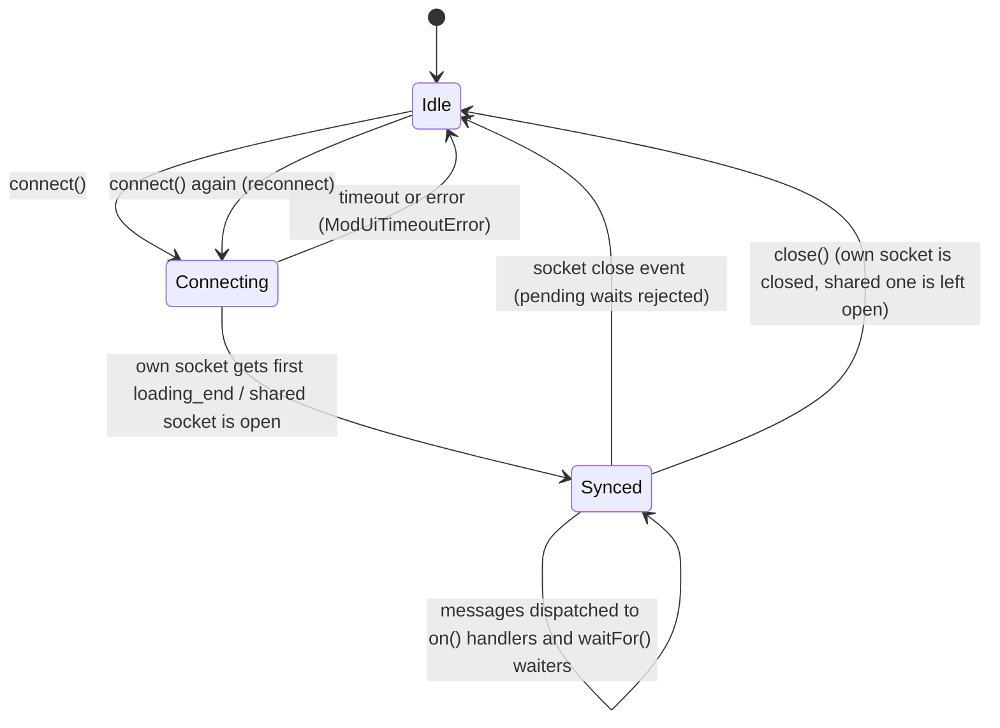

---

## 6. Design rules

- **Classes per feature area**, reachable from `ModUiClient` (`client.pedalboards`, `client.device`,
  `client.events`). New areas (snapshots, banks, ...) follow the same shape.
- **All HTTP goes through `HttpTransport`**: `fetch` with `cache: 'no-store'`, JSON decoding, non-2xx →
  `ModUiHttpError`. Use `getJson` for `GET` and `postForm` for form posts; add a method there if a new body
  type is needed (e.g. JSON or binary).
- **Never use globals directly**: `fetch` and `WebSocket` are injected through `ModUiClientOptions`, which is
  what makes the tests possible.
- **Await the backend's confirmation** when it arrives over the WebSocket: register `events.waitFor()` *before*
  the HTTP call and cancel it on failure.
- **Serialize operations that change the running pedalboard** through `Device`'s internal queue (`load`, `reset`, and everything in `currentPedalboard`).
- **Reject, do not throw**: public methods return rejected promises for bad arguments, never synchronous exceptions.
- **Guard destructive calls in the client** (`PedalboardReference.remove()` refuses factory and default pedalboards) because the backend does not validate paths.
- **Remember the backend conventions** (see `docs/openapi.yml`): many handlers answer `200` with a bare
  `false` on failure; turn that into a `ModUiError`. Trailing slashes in paths matter.
- **No runtime dependencies.** The output is one IIFE file (ES2018) loaded by a `<script>` tag.
- **Documentation**: every public symbol has TSDoc in English, naming the backend calls and their
  `operationId`, the errors thrown, and an `@example`.

---

## 7. Adding an endpoint or a feature area

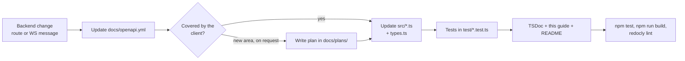

Checklist for a new area (example: snapshots):

1. Wire types in `src/types.ts`, copied from the matching schemas in `docs/openapi.yml`.
2. A class in its own module (`src/snapshots.ts`) taking `HttpTransport` (and `EventChannel` if it waits for
   WebSocket confirmations) in its constructor.
3. Wire it in `ModUiClient` (`client.snapshots`), export it from `src/index.ts` and add it to `window.ModUi`.
4. A test file `test/snapshots.test.ts` using the helpers: `makeClient(routes)` fakes HTTP routes as
   `"METHOD /path"` → JSON, `connected(client)` opens the fake socket and plays the initial replay, and
   `socket.emit('...')` pushes server messages.
5. Update this guide (diagrams included), the README section and the plan.

---

## 8. Build and test

```sh
cd html/js/lib/modui-client
npm install
npm test          # tsc --noEmit (strict, no unused locals) + vitest
npm run build     # esbuild src/index.ts → ../modui-client.js (IIFE, ES2018, not minified)
npm run watch     # rebuild on change, inline source map
```

Requires Node.js 22.12 or newer. The generated `html/js/lib/modui-client.js` is git-ignored; release builds
must run the build before installing `html/` (`setup.py` and `mod-deploy.sh` pick it up from `html/js/lib/*.js`).

---

## 9. Known limitations

- Loading a pedalboard through the client while the classic UI is open reloads the canvas (WebSocket), but the
  title kept by the classic UI is not updated: it only learns titles from its own HTTP responses.
- If another client or the HMI loads a pedalboard at the same moment, its `loading_end` may resolve this
  client's wait; the backend gives no way to correlate them.
- `PedalboardInfo` has no bundle path on the wire; the client adds `bundlepath` itself.
- The classic UI keeps its own title / bundle (learned from its own HTTP responses). Saving through the client
  does not update them, so after `currentPedalboard.save*()` the classic UI may still show the old name until reload.
- `currentPedalboard.get()` / `save()` rely on `GET /pedalboard/current`, added together with this API; they do not
  work against older mod-ui servers.
- `currentPedalboard.save()` / `saveAs()` wait for the thumbnail regeneration, which can take a few seconds on a device (the renderer runs at low priority); a failure of that wait is ignored.
- Plugins and connections come from the WebSocket, not from an endpoint. After an own socket reconnects, pedalboard ports that disappeared in between stay in the model until the backend announces them again.
- `setValue()`, `setActive()`, `toggle()` and `move()` cannot confirm anything: the backend does not answer the sender of `param_set` / `plugin_pos`. They resolve when the message is sent; if the backend refuses a value (it only refuses ports with a host designation, which the client already blocks), nothing tells the caller.
- `PatchParam.setValue()` cannot confirm anything either (the sender of `patch_set` gets no frame). Only `"` is escaped on the way to mod-host, so a backslash in a string reaches the plugin as it is. Empty strings are refused by the client. Only parameters the host tracks (atom types Bool, Int, Long, Float, Double, String, Path, URI, with ranges) report values; vectors are not supported. Whether `refresh()` gets an answer depends on the plugin.
- `plugins.add()` always generates the instance name (like the classic UI). If the backend creates the plugin but cannot read its description, it answers `404` and the plugin stays in the pedalboard.
- `connections.disconnect()` checks the model first because the backend answers `true` and announces `disconnect` even when nothing was connected. A connection made by another client a moment ago is known as soon as its `connect` frame arrives.
- Connections to plugins that are not installed are left out of `connections.list()` (their ports are unknown).
- `reference.copy()` cannot choose the title of the copy and refuses titles with quotes, `/`, `&`, `\`, `*`, `[` or control characters, because of how the backend renames the copy.
- A thumbnail URL is a snapshot: after another client regenerates the images, call `status()` (or `generate()`) on a reference to learn the new creation time, otherwise the URL may still hit the browser's one-year cache.
