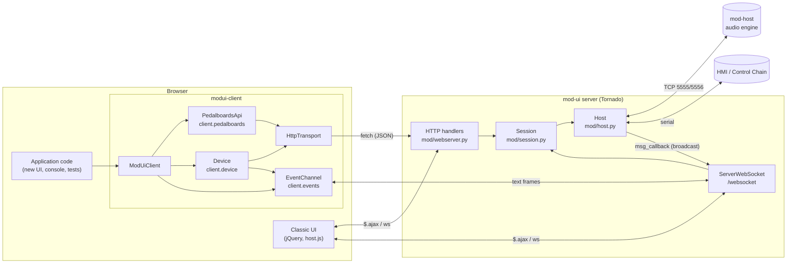
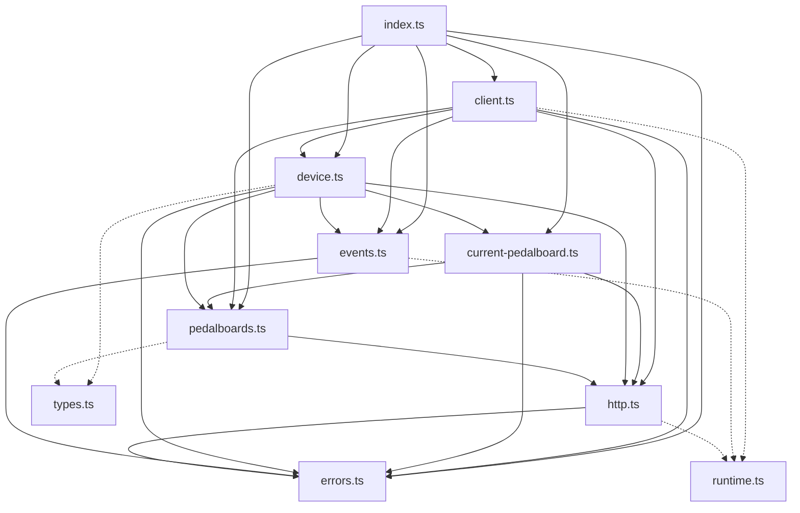
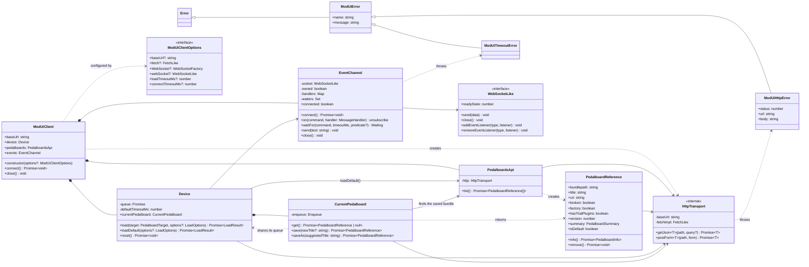
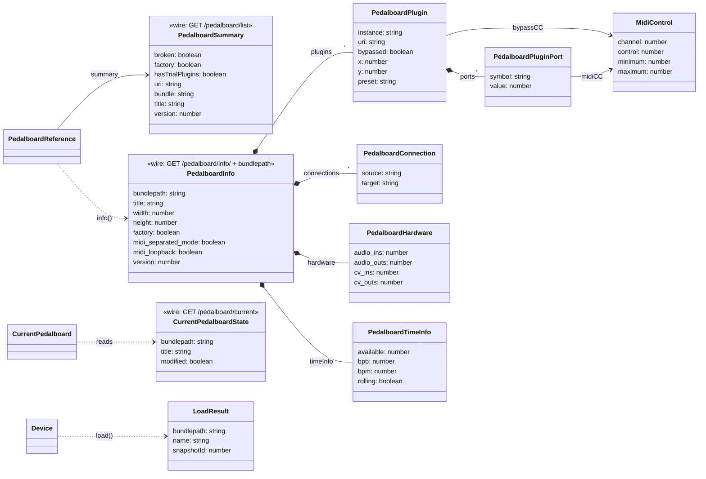
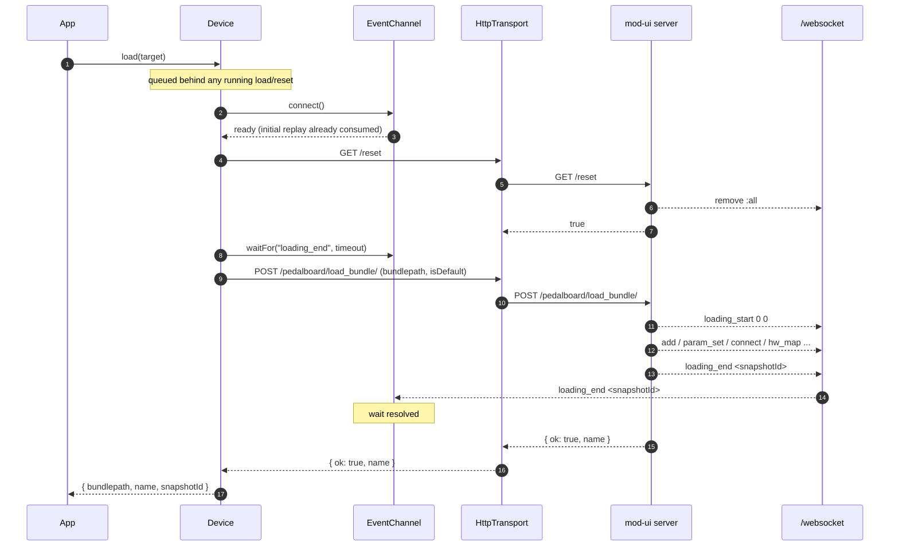
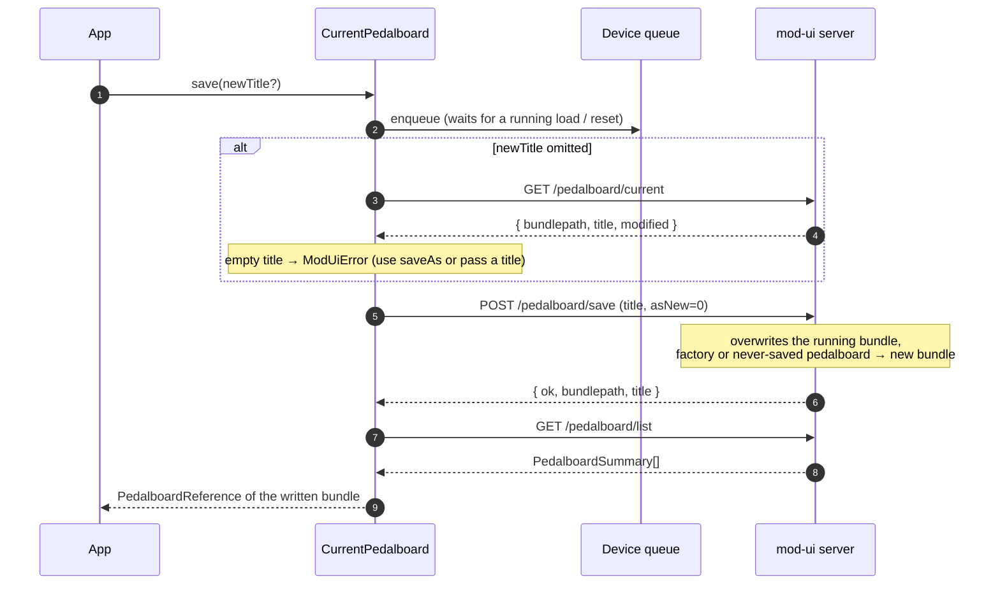
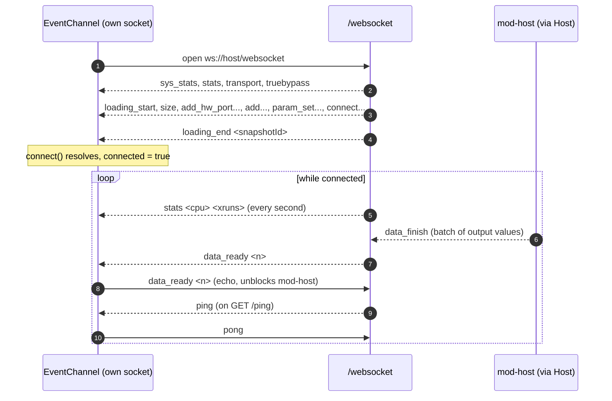
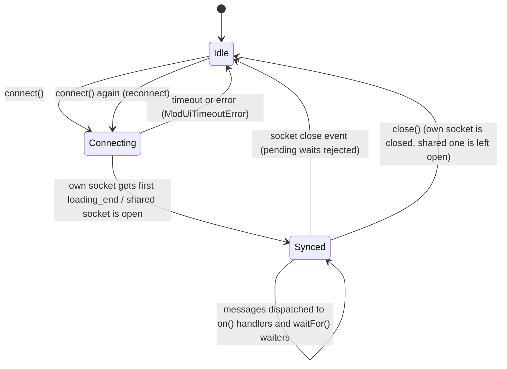
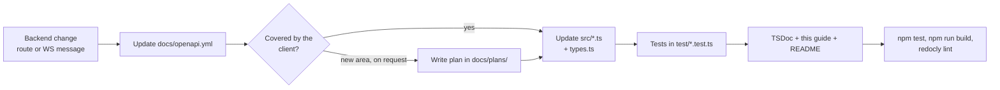

# modui-client — developer guide

`modui-client` is a typed, class-based TypeScript client for the mod-ui backend. It talks to the server with
`fetch` (HTTP) and listens to the main WebSocket (`/websocket`), so callers can `await` operations until the
backend has *really* finished them (for example, until a pedalboard is fully loaded).

- **Source**: [`html/js/lib/modui-client/src/`](../html/js/lib/modui-client/src/)
- **Tests**: [`html/js/lib/modui-client/test/`](../html/js/lib/modui-client/test/)
- **Build output** (generated, not versioned): `html/js/lib/modui-client.js`
- **Wire contract**: [`docs/openapi.yml`](openapi.yml)
- **Plan / roadmap**: [`docs/plans/2026-10-modui-client.md`](plans/2026-10-modui-client.md)

Current scope: **pedalboards** (list, info, remove, load, load default, reset, get / save / save-as of the running pedalboard) plus raw WebSocket access.

---

## 1. Quick start

In a mod-ui page, where `index.html` loads the build and exposes `window.ModUiClient`:

```js
const client = new ModUiClient();

const pedalboards = await client.pedalboards.list();   // PedalboardReference[]
const info = await pedalboards[0].info();               // PedalboardInfo (+ bundlepath)

const result = await client.device.load(info);          // resolves after WebSocket "loading_end"
console.log(result.name, result.snapshotId);

await client.device.loadDefault();                      // the empty "Untitled" pedalboard

// The running pedalboard
const current = await client.device.currentPedalboard.get();   // PedalboardReference | null (null = untitled)
await client.device.currentPedalboard.save();                  // overwrite it, keeping its title
await client.device.currentPedalboard.save('New name');        // overwrite and rename
const copy = await client.device.currentPedalboard.saveAs('Solo');  // new bundle ("Solo 2" if taken)

// Library management
const mine = (await client.pedalboards.list()).filter((pb) => !pb.factory && !pb.isDefault);
await mine[0].remove();                                 // throws ModUiError for factory / default pedalboards
```

Other setups:

```ts
// Another origin, or Node.js >= 22 (global fetch and WebSocket)
const remote = new ModUiClient({ baseUrl: 'http://modduo.local' });

// Inside the classic UI, sharing its socket (window.ws from host.js) instead of opening a second one
const shared = new ModUiClient({ webSocket: window.ws });

// Raw WebSocket messages
const off = client.events.on('stats', (args) => {
  const [cpuLoad, xruns] = args.split(' ');
  console.log(`CPU ${cpuLoad}% / ${xruns} xruns`);
});
await client.connect();
off();
```

---

## 2. Where it sits



Every change made through HTTP is broadcast by the backend to **all** WebSocket clients, which is how the
classic UI, other tabs and this client stay in sync.

---

## 3. Source layout

```
html/js/lib/modui-client/
├── package.json         # devDependencies only: typescript, esbuild, vitest (exact versions)
├── tsconfig.json        # strict, noEmit, ES2018 + DOM
├── src/
│   ├── index.ts         # public exports + window.ModUiClient / window.ModUi (build entry)
│   ├── client.ts        # ModUiClient, ModUiClientOptions
│   ├── pedalboards.ts   # PedalboardsApi, PedalboardReference
│   ├── device.ts        # Device
│   ├── current-pedalboard.ts  # CurrentPedalboard (client.device.currentPedalboard)
│   ├── events.ts        # EventChannel, MessageHandler, Waiting
│   ├── http.ts          # HttpTransport (internal)
│   ├── errors.ts        # ModUiError, ModUiHttpError, ModUiTimeoutError
│   ├── types.ts         # wire types (mirror docs/openapi.yml schemas) + LoadOptions/LoadResult
│   └── runtime.ts       # FetchLike, WebSocketLike, WebSocketFactory
└── test/
    ├── helpers.ts       # FakeWebSocket, fakeFetch, fixtures, makeClient, connected, flush
    ├── client.test.ts
    ├── pedalboards.test.ts
    ├── device.test.ts
    ├── current-pedalboard.test.ts
    └── events.test.ts
```

Module dependencies (arrows point to what a module imports):



Dotted arrows are type-only imports. There are no cycles; `types.ts` and `runtime.ts` import nothing.

---

## 4. Class diagram



### Data model

`PedalboardReference` is a lightweight handle built from a list entry; `PedalboardInfo` is the full bundle content.
Both carry `bundlepath`, so both can be passed to `Device.load()` (type `PedalboardTarget`).



---

## 5. Key flows

### 5.1 Loading a pedalboard (`device.load`)

The backend pushes `loading_start … loading_end` on the WebSocket **during** the `load_bundle` request, i.e.
usually *before* the HTTP response. The client therefore registers the wait first, then sends the request.
`load_bundle` does not clear the running graph, so a reset always comes first (same sequence as the classic UI).



Failure paths:

| Situation | Result |
|-----------|--------|
| `/reset` answers `false` | `ModUiError("…refused to reset…")`; `load_bundle` is not called |
| `load_bundle` answers `{ ok: false }` (bundle missing) | wait cancelled, `ModUiError("…could not load…")` |
| non-2xx HTTP status | wait cancelled, `ModUiHttpError` (status, url, body) |
| no `loading_end` within `timeoutMs` (default 60 s) | `ModUiTimeoutError` |
| socket closes or the server sends `stop` | `ModUiError("WebSocket closed" / "backend stopped")` |

`device.loadDefault()` is the same flow, after picking the list entry whose bundle ends in
`/default.pedalboard`, and with `isDefault=1` (the backend then clears the current title and path).

### 5.2 Saving the running pedalboard (`currentPedalboard.save` / `saveAs`)

`POST /pedalboard/save` always needs a `title` and an `asNew` flag (see `savePedalboard` in `docs/openapi.yml` for
the exact rules). The client hides both: `save()` means `asNew=0` and reads the current title when you do not pass
one; `saveAs()` means `asNew=1`. Both return the saved pedalboard as a `PedalboardReference` found in the list.



What the backend does with `asNew`:


`currentPedalboard.get()` returns `null` for an untitled pedalboard (after `reset()` or `loadDefault()`), because it
has no bundle. It needs the backend endpoint `GET /pedalboard/current`.

### 5.3 Connecting and flow control (`events.connect`)

A new socket first receives a replay of the whole current state, which ends with `loading_end`. `connect()`
resolves only after it, so that replay is never mistaken for the end of a load requested later.



With a **shared** socket (`options.webSocket`), `connect()` resolves as soon as the socket is open and the
client never answers `ping` / `data_ready`, because the socket's owner (the classic UI's `host.js`) already does.

### 5.4 EventChannel lifecycle



---

## 6. Design rules

- **Classes per feature area**, reachable from `ModUiClient` (`client.pedalboards`, `client.device`,
  `client.events`). New areas (snapshots, banks, plugins, ...) follow the same shape.
- **All HTTP goes through `HttpTransport`**: `fetch` with `cache: 'no-store'`, JSON decoding, non-2xx →
  `ModUiHttpError`. Use `getJson` for `GET` and `postForm` for form posts; add a method there if a new body
  type is needed (e.g. JSON or binary).
- **Never use globals directly**: `fetch` and `WebSocket` are injected through `ModUiClientOptions`, which is
  what makes the tests possible.
- **Await the backend's confirmation** when it arrives over the WebSocket: register `events.waitFor()` *before*
  the HTTP call and cancel it on failure.
- **Serialize operations that change the running pedalboard** through `Device`'s internal queue (`load`, `reset`, and everything in `currentPedalboard`).
- **Reject, do not throw**: public methods return rejected promises for bad arguments, never synchronous exceptions.
- **Guard destructive calls in the client** (`PedalboardReference.remove()` refuses factory and default pedalboards) because the backend does not validate paths.
- **Remember the backend conventions** (see `docs/openapi.yml`): many handlers answer `200` with a bare
  `false` on failure; turn that into a `ModUiError`. Trailing slashes in paths matter.
- **No runtime dependencies.** The output is one IIFE file (ES2018) loaded by a `<script>` tag.
- **Documentation**: every public symbol has TSDoc in English, naming the backend calls and their
  `operationId`, the errors thrown, and an `@example`.

---

## 7. Adding an endpoint or a feature area



Checklist for a new area (example: snapshots):

1. Wire types in `src/types.ts`, copied from the matching schemas in `docs/openapi.yml`.
2. A class in its own module (`src/snapshots.ts`) taking `HttpTransport` (and `EventChannel` if it waits for
   WebSocket confirmations) in its constructor.
3. Wire it in `ModUiClient` (`client.snapshots`), export it from `src/index.ts` and add it to `window.ModUi`.
4. A test file `test/snapshots.test.ts` using the helpers: `makeClient(routes)` fakes HTTP routes as
   `"METHOD /path"` → JSON, `connected(client)` opens the fake socket and plays the initial replay, and
   `socket.emit('...')` pushes server messages.
5. Update this guide (diagrams included), the README section and the plan.

---

## 8. Build and test

```sh
cd html/js/lib/modui-client
npm install
npm test          # tsc --noEmit (strict, no unused locals) + vitest
npm run build     # esbuild src/index.ts → ../modui-client.js (IIFE, ES2018, not minified)
npm run watch     # rebuild on change, inline source map
```

Requires Node.js 22.12 or newer. The generated `html/js/lib/modui-client.js` is git-ignored; release builds
must run the build before installing `html/` (`setup.py` and `mod-deploy.sh` pick it up from `html/js/lib/*.js`).

---

## 9. Known limitations

- Loading a pedalboard through the client while the classic UI is open reloads the canvas (WebSocket), but the
  title kept by the classic UI is not updated: it only learns titles from its own HTTP responses.
- If another client or the HMI loads a pedalboard at the same moment, its `loading_end` may resolve this
  client's wait; the backend gives no way to correlate them.
- `PedalboardInfo` has no bundle path on the wire; the client adds `bundlepath` itself.
- The classic UI keeps its own title / bundle (learned from its own HTTP responses). Saving through the client
  does not update them, so after `currentPedalboard.save*()` the classic UI may still show the old name until reload.
- `currentPedalboard.get()` / `save()` rely on `GET /pedalboard/current`, added together with this API; they do not
  work against older mod-ui servers.
- Saving does not wait for the thumbnail: it is regenerated in the background (`/pedalboard/image/*`).
